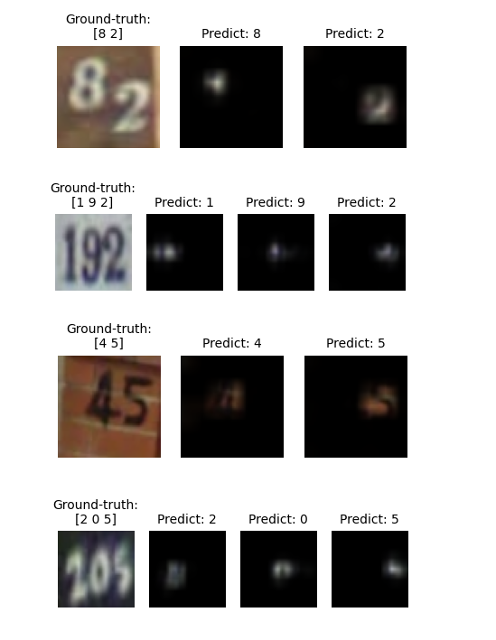
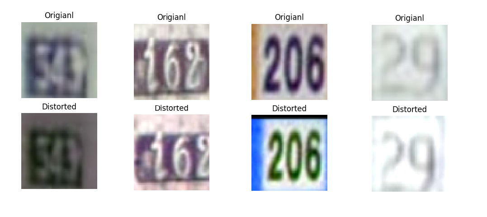
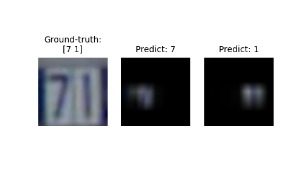

# Pytorch-Attention-RNN-for-SVHN
This code implements attention-based RNN with Pytorch to recognize SVHN multi-digit numbers.

The entire system has two compoents: A **CNN encoder** that extracts visual features from the input images, and a **attention-based RNN decoder** that emits digit sequence as outputs.
The idea is inspired by [Xu _et al._](https://arxiv.org/pdf/1502.03044.pdf), who proposed a model to **automatically learns where to look** when generating corresponding text for an image.
Similar to [Goodfellow _et al._](http://arxiv.org/pdf/1312.6082.pdf), our model runs directly on the entire sequence without resorting to character segmentation.

The default recipe can achieve **~96.2%** test accuracy, which is slightly better than [Goodfellow _et al._](http://arxiv.org/pdf/1312.6082.pdf) (96.03%).

You can also generalize this method to other OCR tasks such as license plate recognition or text transcription.

Here are some attention and transcripts generated on _test_ images:



## Network Architecture
### CNN encoder
The CNN is for learning high-level visual representation, which is typically a output feature map.
It is defined in `cnn.py`.
Note that the total down-sampling rate must highly depend on your input image size.
By default the input size is **54x54**, and there are three MaxPooling of stride 2 throughout the CNN, so the input will be down-sampled by **8x**.
For smaller image size, you should use less down-sampling.

### RNN decoder
The RNN deocder is a two-layer GRU. It converts the CNN encoder's output feature map into a sequence of labels using attention mechanism.
It is defined in `build_model.py`.

## Requirements
* Python 3.6
* Pytorch 1.4
* torchvision 0.6.0
* [PyTorch-NLP](https://github.com/PetrochukM/PyTorch-NLP) 0.5.0
* h5py 2.10.0
* matplotlib
* Pillow
* tqdm

## Usage
### Data
Download SVHN dataset format 1 (train.tar.gz, test.tar.gz , extra.tar.gz) from http://ufldl.stanford.edu/housenumbers/ .
We would use `train` set and `extra` set for training and evaluate the final performance on `test` set.

### Convert digitStruct.mat to JSON
After extracting downloaded *.tar.gz files, you can find `digitStruct.mat` in each folder.
The digitStruct.mat stores all of the annotation infomation of the images.
However accessing *.mat files can be slow and inefficient, so we would like convert the digitStruct.mat to JSON.

Modify the parameter `ROOT` in `prepare_data.py` to where contains the data (`train/`, `extra/`, `test/`), and run:

```bash
python prepare_data.py
```

### Inspect data
Data aumentation is crucial to combact overfitting.
Specifically, we apply random cropping and color jittering to the images
Running `data.py` can visualize exactly the differences:
```bash
python data.py
```


### Training
To train with default recipe, simply run:
```bash
python train.py
```
The related parameters are at the beginning of `train.py`. You can easily check and modify them.

### Test
To calculate the accuracy on test set:
```bash
python eval.py
```
Note we follow the metric in [Goodfellow _et al._](http://arxiv.org/pdf/1312.6082.pdf) .
That is, a predicted sequence is correct only when it absolutely matches the ground-truth, digit-by-digit.

If you just want to visualize the attention:
```bash
python play.py
```


## References
[1] Goodfellow _et al._, "Multi-digit Number Recognition from Street View Imagery using Deep Convolutional Neural Networks",
http://arxiv.org/pdf/1312.6082.pdf

[2] Xu _et al._, "Show, Attend and Tell: Neural Image Caption Generation with Visual Attention",
https://arxiv.org/pdf/1502.03044.pdf


